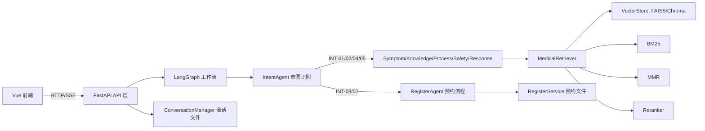

# 智能医疗助手（Medical AI Assistant）

一个面向中文场景的医疗问答与预约协同系统，后端基于 FastAPI + LangGraph，前端基于 Vue 3。项目核心目标是把“症状咨询、知识检索、风险分级、预约挂号”放进同一条可追踪的业务链路中。

本项目适合以下场景：
- 医疗 SaaS 演示系统
- 医院内部智能问诊辅助台原型
- 毕业设计 / 课程项目升级版
- RAG + 多智能体流程编排实践

---

## 1. 项目亮点

- 多智能体工作流：意图识别、症状解析、知识检索、结果加工、安全审核、回复生成、预约流程。
- 医疗 RAG 检索链路完整：向量检索 + BM25 + 混合融合 + MMR 去冗余 + Cross-Encoder 重排。
- 支持流式输出（SSE）：前端逐段渲染，体验接近实时打字。
- 预约流程可持续对话：支持“中断预约聊别的话题，再继续预约”。
- 文档接入能力：支持 `.txt / .pdf / .docx` 入库。
- 向量库可选：FAISS（默认）或 Chroma。

---

## 2. 技术栈

### 后端
- FastAPI + Uvicorn
- LangChain + LangGraph
- 向量库：FAISS / Chroma
- Embedding：HuggingFace（默认 `BAAI/bge-m3`）或 OpenAI 兼容 Embedding API
- Reranker：Sentence-Transformers CrossEncoder（默认 `BAAI/bge-reranker-v2-m3`）

### 前端
- Vue 3 + Vite
- 原生 CSS 设计系统（企业级医疗 SaaS 风格）

### 依赖（关键）
- `langchain`, `langgraph`, `langchain-openai`, `langchain-huggingface`
- `faiss-cpu`, `chromadb`
- `sentence-transformers`, `rank-bm25`, `jieba`
- `pypdf`, `python-docx`

---

## 3. 系统架构



---

## 4. 智能体说明（有几个、各自做什么）

当前工作流内共 **7 个智能体节点**（其中 6 个为通用医疗节点，1 个为预约节点）：

1. `IntentAgent`（`app/agents/intent_agent.py`）
- 负责将用户输入分类到意图编码。
- 当前意图编码：
  - `INT-01` 症状咨询
  - `INT-02` 医学知识问答
  - `INT-03` 预约挂号
  - `INT-04` 健康建议
  - `INT-05` 用药信息
  - `INT-06` 闲聊
  - `INT-07` 取消预约

2. `SymptomAgent`（`app/agents/symptom_agent.py`）
- 对症状类输入做结构化抽取。
- 输出字段包括症状列表、持续时间、严重程度、受影响部位、初步评估、建议。

3. `KnowledgeAgent`（`app/agents/knowledge_agent.py`）
- 调用 RAG 检索器获取相关知识上下文。
- 结合 LLM 生成知识型回答草案，并返回关键点、参考来源、置信度。

4. `ProcessAgent`（`app/agents/process_agent.py`）
- 将症状分析结果和知识检索结果进行整合。
- 生成“综合总结、可能原因、行动建议、何时就医、自我护理建议”。

5. `SafetyAgent`（`app/agents/safety_agent.py`）
- 对回复内容做安全评估，输出风险等级（SAFE/LOW/MEDIUM/HIGH）。
- 附加风险因子、告警、免责声明、是否建议就医。

6. `ResponseAgent`（`app/agents/response_agent.py`）
- 把前序结构化结果变成最终用户可读回复。
- 内置“称呼保护”逻辑：用户没明确自报姓名时，不使用推测姓名。

7. `RegisterAgent`（`app/appointment/register_agent.py`）
- 处理预约相关对话：预约创建、查看预约、取消预约、自然语言解析。
- 可识别日期/时间段/科室/手机号等表达，支持流程状态继续。

工作流编排见 `app/workflow.py`：
- 入口是 `intent`
- `INT-03/INT-07` 直接走 `appointment`
- `INT-06`（闲聊）走快速路径直达 `response`
- 其他意图走 `symptom -> knowledge -> process -> safety -> response`

---

## 5. RAG 设计详解

### 5.1 文档接入
在 `app/rag/vector_store.py` 中支持：
- TXT：整篇加载
- PDF：按页提取文本（`pypdf`）
- DOCX：按标题分段 + 表格抽取（`python-docx`）

默认知识目录：`app/rag/medical_docs/`

### 5.2 切片策略（Chunking）
当前默认是 **父子分层切片（Parent-Child Chunking）**：
- 先按较大窗口切父块（`PARENT_CHUNK_SIZE`）
- 再按较小窗口切子块（`CHUNK_SIZE`）
- 子块元数据中保留 `parent_content`，用于重排和最终上下文恢复

关键参数（`app/config/settings.py`）：
- `ENABLE_PARENT_CHILD_CHUNKING=true`
- `PARENT_CHUNK_SIZE=1400`
- `PARENT_CHUNK_OVERLAP=180`
- `CHUNK_SIZE=560`
- `CHUNK_OVERLAP=100`
- `MIN_CHUNK_LENGTH=80`

### 5.3 向量化与索引
- 默认向量模型：`BAAI/bge-m3`
- 向量库默认：`FAISS`
- FAISS 附带：
  - 文档缓存文件（JSONL）
  - 索引签名校验（防止索引与文档不一致）

### 5.4 检索链路
`app/rag/retriever.py` 实现了以下链路：

1. 向量召回（Vector Search）
- `similarity_search_with_score`

2. BM25 召回
- 中文分词优先 `jieba`，失败时回退到逐字切分
- 与向量召回形成双路候选

3. 混合融合（Hybrid Fusion）
- 将向量分和 BM25 分按权重融合
- 默认权重：`vector=0.55`, `bm25=0.45`

4. MMR 去冗余
- 在候选集上做相关性与多样性平衡
- 减少“命中很多但重复内容高”的问题

5. Reranker 重排
- CrossEncoder 模型默认：`BAAI/bge-reranker-v2-m3`
- 对候选进行二次打分，提高最终前 k 条质量

最终输出既可返回纯文本上下文，也可返回带 metadata + score 的结果。

---

## 6. 模型清单（哪些模型干了什么）

> 项目支持按配置切换供应商，默认使用 OpenAI 兼容接口风格。

### 6.1 生成模型（LLM）
由 `app/llm/llm_factory.py` 统一创建：
- DashScope 路径：默认 `qwen-turbo`
- OpenAI 路径：默认 `gpt-4o-mini`

用途：
- 意图识别
- 症状结构化抽取
- 知识回答组织
- 安全评估
- 最终回复生成
- 预约流程中的语义理解（配合规则）

### 6.2 Embedding 模型
- 默认：`BAAI/bge-m3`（HuggingFace）
- 备选：OpenAI / DashScope embedding API

用途：
- 文档向量化建库
- 查询向量化召回
- MMR 相似度计算

### 6.3 重排模型（Reranker）
- 默认：`BAAI/bge-reranker-v2-m3`

用途：
- 对混合检索候选进行语义重排，提升 Top-K 准确度

---

## 7. 会话、预约与数据持久化

### 会话记忆
- 位置：`sessions/<session_id>.json`
- 管理器：`app/memory/conversation.py`
- 内容：消息历史、预约流程步骤状态、预约流程临时数据
- 支持会话 TTL 清理（按天数）

### 预约数据
- 位置：`sessions/<session_id>_appointments.json`
- 服务：`app/appointment/register_service.py`
- 支持：创建、查询、取消、重复预约检测（同 session + 日期 + 时间段）

---

## 8. 前端结构

当前正式前端目录是 `frontend-vue/`：
- `src/App.vue`：主页面与交互逻辑
- `src/components/AppTopHeader.vue`：顶部栏
- `src/components/SidebarNav.vue`：左侧工作台导航
- `src/components/RightInsightPanel.vue`：右侧洞察面板
- `src/style.css`：全局设计系统与响应式样式

说明：
- 根目录 `frontend/static` 为历史静态版本（保留用于参考），实际运行建议使用 `frontend-vue`。

---

## 9. API 一览

核心接口（`app/api.py`）：

- `GET /`：服务状态
- `POST /chat`：主对话（SSE 流式返回）
- `GET /history/{session_id}`：获取会话历史
- `POST /chat/stream`：备用流式接口
- `POST /clear`：清空会话
- `POST /appointment`：预约流程入口
- `GET /my-appointments`：查询我的预约
- `POST /cancel-appointment`：取消预约
- `POST /save-appointment`：直接保存预约
- `POST /model/switch`：切换模型配置

---

## 10. 快速开始

### 10.1 环境要求
- Python 3.10+
- Node.js 18+
- Windows / macOS / Linux 均可（当前脚本对 Windows 更友好）

### 10.2 安装

```bash
# 1) 安装后端依赖
pip install -r requirements.txt

# 2) 安装前端依赖
cd frontend-vue
npm install
```

### 10.3 配置 `.env`
可先复制 `.env.example` 为 `.env`，至少配置：
- 生成模型 API Key（OpenAI 或 DashScope 其一）
- 若使用 API embedding，则配置对应 embedding key

常用项：
- `API_PROVIDER=openai|dashscope`
- `OPENAI_MODEL` / `DASHSCOPE_MODEL`
- `EMBEDDING_PROVIDER=huggingface|openai|dashscope`
- `EMBEDDING_MODEL=BAAI/bge-m3`
- `RERANKER_MODEL=BAAI/bge-reranker-v2-m3`

### 10.4 启动

方式 A（推荐，Windows）：
```bat
start-dev.bat
```

方式 B（手动分开启动）：
```bash
# 后端
python app/api.py

# 前端（另一个终端）
cd frontend-vue
npm run dev
```

默认地址：
- 后端：`http://127.0.0.1:8000`
- 前端：`http://127.0.0.1:3000`

---

## 11. SSE 流式输出说明

`POST /chat` 使用 `text/event-stream` 返回，事件类型包括：
- `start`：助手开始回复
- `message`：增量文本片段
- `complete`：收尾结构化信息（意图、风险、来源、预约等）

可通过环境变量调节输出粒度：
- `STREAM_FLUSH_CHARS`：每次 flush 的字符数（`1` 接近 token 级体验）
- `STREAM_FLUSH_DELAY_MS`：每次 flush 的额外延迟（`0` 为最快）

---

## 12. 目录结构（核心）

```text
medical-ai-assistant-github/
├─ app/
│  ├─ api.py                    # FastAPI 入口与接口定义
│  ├─ workflow.py               # LangGraph 工作流编排
│  ├─ state.py                  # 工作流状态定义
│  ├─ agents/                   # 通用医疗智能体
│  ├─ appointment/              # 预约流程与服务
│  ├─ rag/                      # 文档加载、切片、向量库、检索器
│  ├─ llm/                      # 模型工厂与 Prompt
│  ├─ memory/                   # 会话持久化
│  └─ utils/                    # 日志与风险关键词
├─ frontend-vue/                # 正式前端（Vue 3 + Vite）
├─ frontend/                    # 历史静态前端（保留）
├─ faiss_index/                 # FAISS 索引与缓存
├─ sessions/                    # 会话/预约持久化目录（运行时生成）
├─ requirements.txt
├─ .env.example
└─ start-dev.bat
```

---

## 13. 常见问题与排查

### 1) 首次启动慢
- 原因：首次加载 embedding 模型 / reranker / 构建索引。
- 建议：
  - 使用本地缓存
  - 首次完成后保留 `faiss_index`
  - 生产环境可在启动后后台 warmup

### 2) 检索质量波动
- 优先检查文档质量（标题、段落、术语统一）
- 调整 `TOP_K_RETRIEVAL`、`HYBRID_*_WEIGHT`、`MMR_LAMBDA`
- 重建索引时清理旧索引，避免旧切片残留

### 3) 推流看起来不流畅
- 后端：将 `STREAM_FLUSH_CHARS` 调小
- 前端：已做节流渲染，避免每个片段都触发重排

### 4) HuggingFace 下载慢或限流
- 配置 `HF_TOKEN` 可提升稳定性和速率
- Windows 建议开启开发者模式减少 symlink 警告

---

## 14. 安全与合规提示

- 本系统输出仅用于健康咨询参考，不应替代临床诊断。
- 对高风险症状应引导线下就医或急救。
- 推送到公开仓库前请移除以下敏感信息：
  - `.env` 中所有 API Key
  - `sessions/` 中用户对话与预约数据
  - 本地索引中可能包含私有文档内容（按需清理）

---

## 15. 许可证

当前仓库未显式声明许可证。若计划公开发布，建议补充 `LICENSE`（如 MIT / Apache-2.0）。

